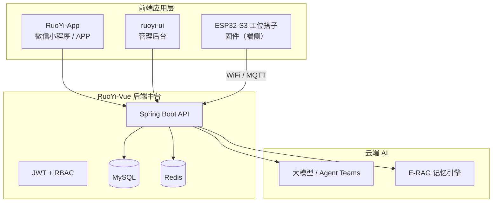

# 桌面终端助理 · 工位搭子

> 基于 WiFi + AI 的多模态环境感知可动桌面陪伴系统  
> 情绪价值为主，轻度效率为辅 —— 懂你的桌面搭子

[GitHub](https://github.com/GZXchina/Desktop-terminal-assistant)
[RuoYi](https://gitee.com/y_project/RuoYi-Vue)
[UniApp](https://uniapp.dcloud.net.cn/)

---

## 项目简介

**工位搭子**（仓库名：桌面终端助理）面向打工人的工位场景，将 ESP32-S3 嵌入式硬件、云端大模型与移动端控制中枢整合为一体，提供可动的桌面陪伴体验：在你专注时克制打扰，在久坐或加班时主动关怀，并通过语音与云台实现物理交互。

本仓库是完整的软件工程载体，包含：


| 层级      | 目录                  | 说明                                   |
| ------- | ------------------- | ------------------------------------ |
| 移动端     | `RuoYi-App/`        | 微信小程序 / APP 控制中枢（设备、记忆、看板、企业报表）      |
| 后端中台    | `RuoYi-Vue-master/` | 用户、权限、设备、记忆等业务 API（基于若依）             |
| AI 工程规范 | `skills/`           | Architect Sage 思维技能库，指导 AI 辅助开发与架构决策 |
| 产品与架构文档 | 根目录 `*.md`          | PRD、SD、技术文档、开发范式等                    |


---

## 核心能力

### 硬件侧（ESP32-S3）

- **环境感知**：WiFi CSI 非接触式活动/呼吸检测（非医疗级）
- **多模态融合**：雷达 + CSI + 语音 + 视觉（场景理解，非监控用途）
- **可动交互**：云台舵机控制，支持语音 Function Call 驱动
- **端云协同**：设备侧采集与唤醒，大模型运行于云端

### 软件侧（本仓库）

- **环境感知看板**：实时状态、健康仪表盘、情绪曲线
- **设备控制台**：虚拟摇杆、模式切换、关怀设置、音色调节
- **记忆时光**：E-RAG 四维记忆检索、语义搜索、时间轴浏览
- **团队健康报表**：企业场景下的团队概览与关怀下发（B 端扩展）
- **若依基础能力**：RBAC 权限、系统管理、代码生成、定时任务等

### 交互哲学：主动应答三元式


| 要素   | 说明                  |
| ---- | ------------------- |
| 环境触发 | 基于传感器判断用户状态（如久坐提醒）  |
| 记忆共鸣 | 结合历史记忆做个性化回应        |
| 克制表达 | 按打扰风险分级，专注时静默、休闲时主动 |


---

## 系统架构




---

## 技术栈


| 类别   | 技术                                              |
| ---- | ----------------------------------------------- |
| 移动端  | UniApp、Vue 2、Vuex、uni-ui、SCSS                   |
| 管理后台 | Vue 2、Element UI、Vue CLI                        |
| 后端   | Spring Boot 4、Spring Security、MyBatis、JWT、Redis |
| 数据库  | MySQL（脚本见 `RuoYi-Vue-master/sql/`）              |
| 硬件平台 | ESP32-S3（双核 240MHz，详见技术文档）                      |
| 开发方法 | 文档驱动 + 技术验证前置 + AI 辅助（见开发范式文档）                  |


---

## 目录结构

```
桌面终端助理/
├── RuoYi-App/                    # 移动端（工位搭子业务页面）
│   ├── pages/
│   │   ├── dashboard/            # 环境感知看板
│   │   ├── device/               # 设备控制台
│   │   ├── memory/               # 记忆时光
│   │   └── enterprise/           # 团队健康报表
│   └── api/                      # 业务 API 封装
├── RuoYi-Vue-master/             # 后端 + 管理后台
│   ├── ruoyi-admin/              # 启动入口
│   ├── ruoyi-system/             # 系统模块
│   ├── ruoyi-ui/                  # Vue 管理端
│   └── sql/                      # 数据库脚本
├── skills/                       # AI 思维与工程技能库
├── 工位搭子_技术文档_v4_整理版.md    # 硬件 + 软件总体技术文档
├── 工位搭子_UniApp平台_PRD(1).md   # 移动端产品需求
├── 工位搭子_UniApp平台_SD.md       # 移动端软件设计
├── 开发范式_SaaS_基于Ruoyi.md      # 团队开发流程与文档规范
├── demo/                         # 项目交互演示（Web + 说明）
│   ├── index.html                # 浏览器端 Demo（无需后端）
│   └── start-demo.ps1            # 一键打开 Demo
└── tech_scheme.md                # Architect Sage 技术方案摘要
```

---

## 项目 Demo

无需部署后端即可体验核心功能：

### Web 演示（最快）

```powershell
# 双击或在项目根目录执行
.\demo\start-demo.ps1
```

浏览器将打开交互式 Demo，包含：**门户导航 · 环境看板 · 设备遥控 · 记忆时光 · 企业报表**，数据每 5 秒自动刷新。

### 移动端演示

1. HBuilderX 打开 `RuoYi-App/`
2. 确认 `config.js` 中 `demoMode: true`（默认已开启）
3. 运行到模拟器 / 微信开发者工具
4. 登录页点击 **「体验 Demo（免后端）」**

详见 [demo/README.md](./demo/README.md)。

---

## 快速开始

### 环境要求


| 组件        | 版本建议                |
| --------- | ------------------- |
| JDK       | 17+                 |
| Maven     | 3.6+                |
| Node.js   | 14+（管理后台 / 移动端构建）   |
| MySQL     | 5.7+ / 8.0          |
| Redis     | 5.0+                |
| HBuilderX | 最新版（UniApp 开发与真机调试） |


### 1. 数据库

```bash
# 导入若依基础库与 Quartz 定时任务库
mysql -u root -p < RuoYi-Vue-master/sql/ry_20260417.sql
mysql -u root -p < RuoYi-Vue-master/sql/quartz.sql
```

按需导入业务扩展脚本（如 `gongwei_20260421(1).sql`）。

### 2. 后端

```bash
cd RuoYi-Vue-master
# 修改 ruoyi-admin/src/main/resources/application-druid.yml 中的数据库与 Redis 连接
mvn clean install
# 启动 ruoyi-admin 模块（IDE 或 java -jar）
```

默认开发端口一般为 `8080`，接口前缀见 `application.yml`。

### 3. 管理后台

```bash
cd RuoYi-Vue-master/ruoyi-ui
npm install
npm run dev
```

浏览器访问控制台，默认账号请参考若依官方文档。

### 4. 移动端（RuoYi-App）

1. 使用 HBuilderX 打开 `RuoYi-App/` 目录
2. 在 `config.js` 中配置后端 API 地址
3. 运行到微信开发者工具或真机调试

业务入口：**首页看板** → **工作台** → 设备控制台 / 记忆时光 / 团队报表。

---

## 文档导航


| 文档                                                   | 内容                           |
| ---------------------------------------------------- | ---------------------------- |
| [工位搭子_技术文档_v4_整理版.md](./工位搭子_技术文档_v4_整理版.md)         | 硬件架构、软件架构、核心模块、竞品与规划         |
| [工位搭子_UniApp平台_PRD(1).md](./工位搭子_UniApp平台_PRD(1).md) | 移动端功能需求、用户场景、验收标准            |
| [工位搭子_UniApp平台_SD.md](./工位搭子_UniApp平台_SD.md)         | 移动端架构、数据、接口与安全设计             |
| [开发范式_SaaS_基于Ruoyi.md](./开发范式_SaaS_基于Ruoyi.md)       | 文档驱动开发流程、AI Prompt 规范        |
| [tech_scheme.md](./tech_scheme.md)                   | Architect Sage 框架与 skills 说明 |
| [RuoYi-Vue 官方文档](http://doc.ruoyi.vip)               | 若依框架使用说明                     |


---

## 开发说明

本项目采用 **文档驱动 + 技术验证前置 + AI 辅助开发** 范式：

```
需求文档(PRD) → 多维度设计(SD) → 数据表 SQL → Ruoyi 代码生成 → API → 业务逻辑
```

- 主 Coder 负责架构与数据设计，组员并行完成技术验证文档  
- CRUD 优先使用若依代码生成器，业务逻辑单独实现  
- 复杂决策可参考 `skills/` 目录下的思维模型与工程技能（架构、性能、调试、合规等）  
- 重要变更记录在 `refreshing.txt`（项目操作日志）

---

## 开源与致谢

本项目的后端与移动端基础框架基于开源项目 **[RuoYi](https://gitee.com/y_project/RuoYi-Vue)** 与 **[RuoYi-App](https://gitee.com/y_project/RuoYi-App)**，遵循 [MIT License](./RuoYi-Vue-master/LICENSE)。

工位搭子业务层（设备控制、记忆、看板、企业报表等）及配套文档、技能库为本项目扩展内容。

---

## 参与贡献

欢迎通过 Issue 与 Pull Request 参与：

1. Fork 本仓库
2. 创建特性分支（`git checkout -b feature/xxx`）
3. 提交变更并确保通过本地构建
4. 发起 Pull Request，说明变更范围与测试情况

提交前请阅读 [开发范式_SaaS_基于Ruoyi.md](./开发范式_SaaS_基于Ruoyi.md)，保持 API 契约与设计文档一致。

---

## 相关链接

- **GitHub 仓库**：[https://github.com/GZXchina/Desktop-terminal-assistant](https://github.com/GZXchina/Desktop-terminal-assistant)  
- **若依官网**：[http://ruoyi.vip](http://ruoyi.vip)  
- **UniApp 文档**：[https://uniapp.dcloud.net.cn/](https://uniapp.dcloud.net.cn/)

---

工位搭子 —— 不是智能音箱，而是懂你的桌面搭子